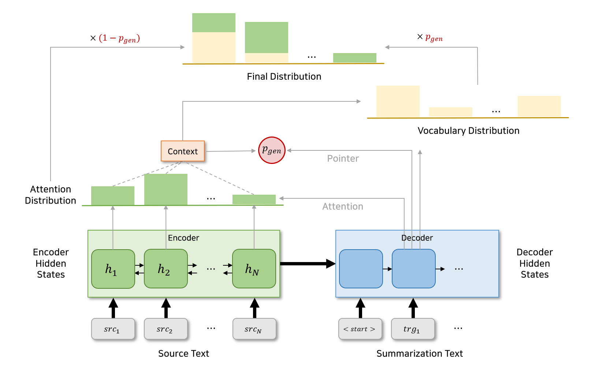

- [Get To The Point: Summarization with Pointer-Generator Networks
](https://arxiv.org/abs/1704.04368)




사용하는 데이터는 아래와 같은 형식을 갖습니다.

```json
{
    "media": "AA일보",
    "id": "123456789",
    "article_original":
        [
        "오늘 아침 미확인 비행물체가 등장했습니다.",
        "서울 근교의 한 숲에서 관측되었습니다.",
        "미확인 비행물체는 최근 들어 많이 관측되고 있습니다.",
        "시민들은 호기심보다 불안한 마음을 갖고 있습니다.",
        "서울시는 해당 물체에 대한 조사를 한다는 입장문을 밝혔습니다.",
        "미확인 비행물체가 앞으로 더 등장할 지 의문입니다.",
        ],
    "abstractive": "갑작스레 등장한 미확인 비행물체가 서울시민을 불안하게 만들고 있다.",
    "extractive": [0, 3, 4]
}

```

---
# TextDataset

## \_\_init\_\_

> path(str),
> max_vocab(int) = 50000,
> mode(str) = "train",
> vocab_dir(str) = None,
> use_sentencepiece(bool) = True

### Parameters
- path: train/eval/test 데이터셋의 경로
- max_vocab: 어휘 사전의 최대 개수
- mode: train/eval/test 모드
- vocab_dir: 기존에 생성된 어휘 사전의 경로
- use_sentencepiece: Sentencepiece 또는 Mecab 사용 여부 결정


## get_vocab
> src(List[List[str]])

주어진 문서로부터 어휘 사전을 생성함

### Parameters
- src: 주어진 전체 문서 리스트

### Returns
1. vocab(dict): 문서로부터 생성된 어휘 사전

## src2idx
> src_sentence(List[str])

주어진 문장으로부터 단어 인덱스 리스트, OOV가 등장한 위치를 저장하는 사전을 생성함

### Parameters
- src_sentence: 원본 문장

### Returns
1. idcs(list): 인덱스로 변환된 원본 문장, 
2. oov_vocabs(dict): OOV가 등장한 위치 인덱스
  - Example
    > {'oov_word_1': [idx_1], 'oov_word_2':[idx_2], ...}

## tgt2idx
> tgt_sentence(List[str]),
> src_oov_vocabs(List[str])

주어진 요약문으로부터 단어 인덱스 리스트, OOV가 등장한 위치를 저장하는 사전을 생성함 (단, 원본 문장에 해당 OOV가 등장했을 때에만 사전에 저장)

### Parameters
- tgt_sentence: 요약문
- src_oov_vocabs: 원본 문장에 등장한 OOV 사전

### Returns
1. idcs(list): 인덱스로 변환된 요약문(Decoding 시작과 끝에 해당하는 special token 포함)
2. oov_vocabs(dict): 원본 문장과 요약문에 함께 등장하는 OOV 단어 사전

## idx2word
> sentence(List[str])

인덱스를 단어(토큰)로 바꾸어 줌

### Parameters
- sentence(List[int] or torch.Tensor): 인덱스로 구성된 문장

### Returns
1. converted_sentence(List[str]): 단어(토큰)로 변환된 문장

## \_\_len\_\_

데이터셋의 길이를 반환

### Returns
1. length(int): 데이터셋의 길이

## \_\_getitem\_\_
> idx(int)

인덱스에 해당하는 데이터를 반환

### Parameters
- idx(int): 데이터셋의 특정 인덱스

### Returns
1. src[idx]: Tokenize 후 인덱스로 변환된 원본 문장
2. tgt[idx]: Tokenize 후 인덱스로 변환된 요약문
3. src_oov_vocabs[idx]: 원본 문장에 등장한 OOV 사전
4. tgt_oov_vocabs[idx]: 원본 문장과 요약문에 함께 등장하는 OOV 단어 사전


---

# PointerGenerator

## \_\_init\_\_
> train_path(str),
> validation_path(str),
> use_sentencepiece(bool),
> vocab_size(int),
> embed_dim(int),
> hidden_dim(int),
> num_encoder_layer(int),
> max_len(int),
> max_decoder_step(int),
> lr(float),
> train_batch_size(int),
> eval_batch_size(int), 
> ptr_gen(bool),
> coverage(bool),
> cov_loss_lambda(float),
> vocab_path(str) = None,
> test_path(str) = None

### Parameters
- train_path: 학습 데이터 경로
- validation_path: 검증 데이터 경로
- use_sentencepiece: Sentencepiece 또는 Mecab 사용 여부 결정
- vocab_size: 어휘 사전 크기
- embed_dim: 단어 임베딩 크기
- hidden_dim: 신경망 은닉층 크기
- num_encoder_layer: 인코더의 층 개수
- max_len: 문장의 최대 길이
- max_decoder_step: 디코더에 의해 생성되는 문장의 최대 길이
- lr: 학습율(learning rate)
- train_batch_size: 학습 배치 크기
- eval_batch_size: 검증 배치 크기
- ptr_gen: pointer-generator 모델 사용
- coverage: coverage mechanism 적용
- cov_loss_lambda: coverage loss의 강도 조절 계수
- vocab_path: 기존에 생성된 어휘 사전의 경로
- test_path: 평가(테스트) 데이터 경로

## forward
> src(torch.tensor),
> tgt_input(torch.tensor),
> src_len(torch.tensor),
> src_padding_mask(torch.tensor),
> vocab(dict),
> src_oov(torch.tensor),
> content_selection(torch.tensor) = None

### Parameters
- src: 
- tgt_input:
- src_len:
- src_padding_mask:
- vocab:
- src_oov:
- content_selection:

### Returns

## training_step

## validation_step

## validation_epoch_end


